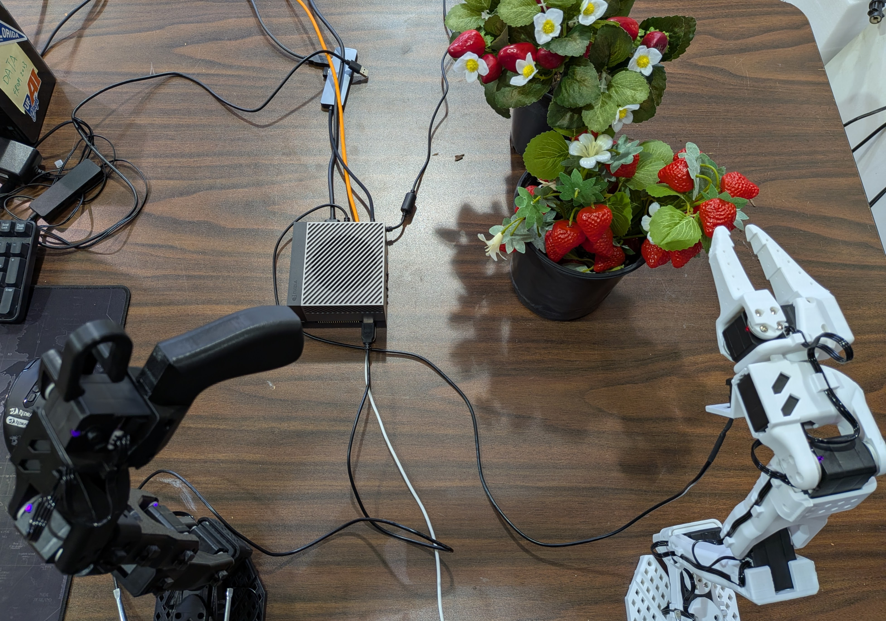

# Pedicel-Targeted Strawberry Harvesting via Behavioral Cloning

<p align="center">
  
</p>

<p align="center">
  <a href="https://huggingface.co/datasets/nitindominicrai/strawberry_pedicel_grasp_teleoperation">
    
  </a>
  <a href="https://huggingface.co/nitindominicrai/act_strawberry_pedicel">
    
  </a>
  
  
  
</p>

> **Paper:** *Pedicel-Targeted Strawberry Harvesting via Imitation Learning on a Low-Cost Teleoperation Platform*  
> Nitin Rai, Won Suk Lee, Hongyoung Jeon, Heping Zhu
> IROS Agribotics Workshop 2026, Pittsburgh, Pennsylvania

---

## Overview

This repository contains the full pipeline for autonomous strawberry pedicel harvesting using behavioral cloning on a low-cost robotic arm. The system learns to grasp the strawberry pedicel (1.4–2.4 mm diameter) from human teleoperation demonstrations, bypassing the need for explicit computer vision detection or motion planning.

**Key features:**
- End-to-end visuomotor policy from wrist-camera input to joint-space actions.
- ACT (Action Chunking with Transformers) with ResNet-50 visual backbone.
- Trained on 130 human teleoperation demonstrations (250k frames).
- Deployed autonomously on Jetson Orin AGX at 15-20 Hz.
- Open-access dataset and pre-trained model on HuggingFace.

---

## Dataset and Pre-trained Model

| Resource | Link | Details |
|---|---|---|
| 🤗 Dataset | [strawberry_pedicel_grasp_teleoperation](https://huggingface.co/datasets/nitindominicrai/strawberry_pedicel_grasp_teleoperation) | 131 episodes, 227K frames, 5.01 GB |
| 🤗 Model | [act_strawberry_pedicel](https://huggingface.co/nitindominicrai/act_strawberry_pedicel) | ResNet-50, 100K steps, loss 0.091 |

---

## Hardware Requirements

| Component | Specification |
|---|---|
| Robot arm | HiWonder SO-ARM101 (leader + follower) |
| Edge compute | NVIDIA Jetson Orin AGX |
| Camera | USB wrist-mounted camera (640×480, 30 fps) |
| Training GPU | NVIDIA B200 (HiPerGator HPC) |
| OS | Ubuntu 20.04, JetPack 5.x |
| CUDA | 11.4 |

---

## Repository Structure

```
autonomous_strawberry_pedicel_harvesting/
├── README.md
├── INSTALL.md                   ← step-by-step setup guide
├── scripts/
│   ├── record_wrist_cam.py      ← standalone wrist camera recorder
│   ├── convert_to_fp16.py       ← convert trained model to FP16
│   └── benchmark_inference.py   ← measure inference speed on Jetson
├── analysis/
│   └── generate_all_figures.py  ← reproduce all paper figures
├── assets/
│   └── teaser.png
└── configs/
    └── configuration_act.py
```

---

## Installation

See [INSTALL.md](INSTALL.md) for the full step-by-step setup guide.

**Quick start:**

```bash
# Clone this repository
git clone https://github.com/nitin-dominic/autonomous_strawberry_pedicel_harvesting
cd autonomous_strawberry_pedicel_harvesting

# Create conda environment
conda create -n lerobot python=3.12 -y
conda activate lerobot

# Install LeRobot
git clone https://github.com/huggingface/lerobot.git
cd lerobot && pip install -e ".[so101]" && cd ..

# Download pre-trained model
hf download nitindominicrai/act_strawberry_pedicel \
    --local-dir models/pretrained_model \
    --repo-type model
```

---

## Usage

### 1. Teleoperation - Data Collection

```bash
lerobot-record \
    --robot.type=so101_follower \
    --robot.port=/dev/ttyACM0 \
    --robot.id=my_awesome_follower_arm \
    --robot.cameras="{ handeye: {type: opencv, index_or_path: 0, width: 640, height: 480, fps: 30, rotation: 180}}" \
    --teleop.type=so101_leader \
    --teleop.port=/dev/ttyACM1 \
    --teleop.id=my_awesome_leader_arm \
    --dataset.repo_id=YOUR_HF_USERNAME/strawberry_harvest \
    --dataset.num_episodes=50 \
    --dataset.single_task="Pick the strawberry pedicel" \
    --dataset.reset_time_s=60 \
    --dataset.push_to_hub=true
```

### 2. Training (B200 GPU × 1)

```bash
python -m lerobot.scripts.lerobot_train \
    --dataset.repo_id=nitindominicrai/strawberry_pedicel_grasp_teleoperation \
    --policy.type=act \
    --output_dir=outputs/act_strawberry \
    --policy.device=cuda \
    --steps=100000 \
    --batch_size=32 \
    --dataset.video_backend=pyav \
    --dataset.use_imagenet_stats=false \
    --policy.vision_backbone=resnet50 \
    --policy.pretrained_backbone_weights=ResNet50_Weights.IMAGENET1K_V2
```

### 3. Autonomous Inference (Jetson AGX Orin)

```bash
lerobot-rollout \
    --strategy.type=base \
    --policy.path=models/pretrained_model \
    --policy.device=cuda \
    --robot.type=so101_follower \
    --robot.port=/dev/ttyACM0 \
    --robot.id=my_awesome_follower_arm \
    --robot.cameras="{ handeye: {type: opencv, index_or_path: 0, width: 640, height: 480, fps: 30, rotation: 180}}" \
    --task="Pick the strawberry pedicel" \
    --duration=45
```

---

## Results

**Deployment characteristics:**
- Inference rate: 15–16 Hz (FP32) / 19–20 Hz (FP16)
- Platform: Jetson Orin AGX, CUDA 11.4
- No cloud compute dependency
- Training loss: 2.84 → 0.091 over 100K steps

---

## Reproduce Paper Figures

```bash
pip install scikit-learn matplotlib pandas numpy
python analysis/generate_all_figures.py
```

---

## Citation

```bibtex
@inproceedings{rai2026pedicel,
  title     = {Pedicel-Targeted Strawberry Harvesting via Imitation Learning
               on a Low-Cost Teleoperation Platform},
  author    = {Rai, Nitin and Lee, Won Suk},
  booktitle = {Proc. IEEE/RSJ IROS Workshop on Agricultural Robotics (Agribotics)},
  year      = {2026},
  address   = {Pittsburgh, Pennsylvania}
}
```

---

## License

Apache 2.0 — see [LICENSE](LICENSE) for details.

---

*Precision Agriculture Lab | Department of Agricultural and Biological Engineering | University of Florida*
